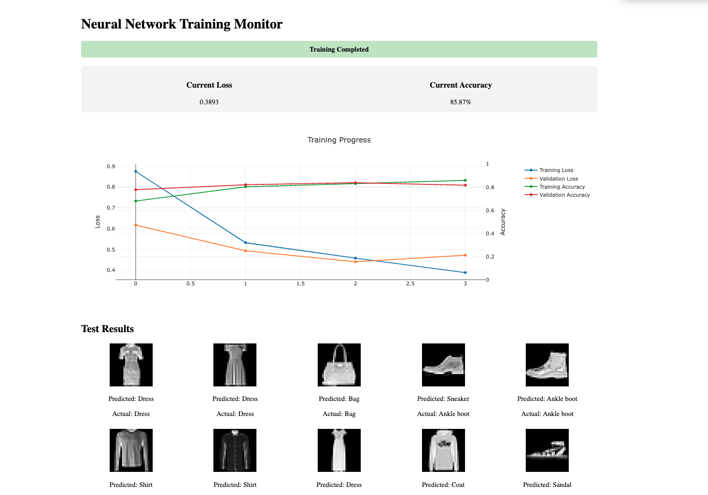

# MNIST CNN Training Visualizer

A real-time visualization tool for monitoring CNN training on the MNIST dataset. Features live training metrics, loss/accuracy curves, and test predictions visualization.



## Features

- Real-time training visualization
- Combined loss and accuracy curves
- Live metrics updates (loss and accuracy)
- Test predictions on random samples
- CUDA support for GPU acceleration
- Clean and responsive web interface

## Requirements

```bash
pip install -r requirements.txt
```

## Quick Start

1. Clone the repository:
```bash
git clone <repository-url>
cd mnist-cnn-visualizer
```

2. Start the visualization server:
```bash
python server.py
```

3. In a new terminal, start training:
```bash
python main.py
```

4. Open your browser and navigate to:
```
http://localhost:5000
```

## Model Architecture

4-layer CNN optimized for MNIST:
- Input: 28x28 grayscale images
- Conv1: 32 filters, 3x3 kernel, ReLU, MaxPool
- Conv2: 64 filters, 3x3 kernel, ReLU, MaxPool
- Conv3: 128 filters, 3x3 kernel, ReLU, MaxPool
- Conv4: 256 filters, 3x3 kernel, ReLU, AdaptiveAvgPool
- Output: 10 classes (digits 0-9)

## Training Parameters

- Batch size: 512
- Learning rate: 0.001
- Optimizer: Adam
- Loss function: CrossEntropyLoss
- Epochs: 4

## Project Structure

```
├── README.md           # Project documentation
├── HowToDo.md          # How to do run the project
├── requirements.txt    # Project dependencies
├── main.py            # Training script
├── model.py           # CNN architecture
├── server.py          # Flask visualization server
└── templates
    └── index.html     # Web interface
```

## Features in Detail

1. **Real-time Monitoring**
   - Loss curves (training and validation)
   - Accuracy curves (training and validation)
   - Current loss and accuracy metrics
   - Updates every second

2. **Test Results**
   - Displays 10 random test images
   - Shows predicted vs actual labels
   - Updates automatically after training

3. **GPU Support**
   - Automatic CUDA detection
   - Falls back to CPU if GPU unavailable

## Common Issues

1. **Port Already in Use**
   ```bash
   # Kill process using port 5000
   lsof -i :5000
   kill -9 <PID>
   ```

2. **CUDA Out of Memory**
   - Reduce batch size in main.py
   - Free up GPU memory
